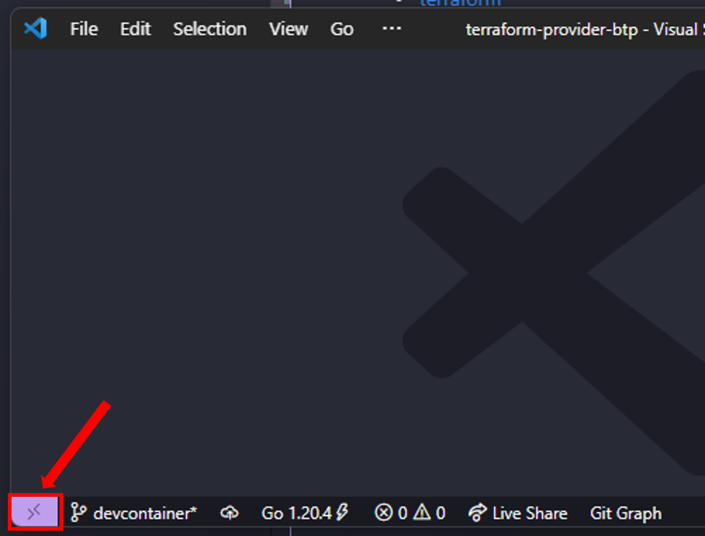

# Development Setup

If you want to contribute to the Terraform provider for SAP BTP the following sections describe how to setup your development environment.

Please be also aware of the [contribution guidelines](../CONTRIBUTING.md) available in this repository.

## Setup of Development Environment

First you need to setup your development environment. The following sections describe the options you have.

## GitHub Codespaces

**Step 1:** Open the repository in GitHub Code spaces via the button:

[](https://github.com/codespaces/new?hide_repo_select=true&ref=main&repo=618531988)

**Step 2:** There is no step 2 😎

## Dev Container

> **Note** - In order to use dev containers you must have a container runtime up and running on machine. For details we refer to the official documentation about [Developing inside a Container](https://code.visualstudio.com/docs/devcontainers/containers)

First you must clone the repository:

```bash
git clone https://github.com/SAP/terraform-provider-btp.git
```

Then open the cloned repository in [Visual Studio Code](https://code.visualstudio.com/). Within Visual Studio Code press the "Open a remote Window" button in the lower left corner:



 Visual Studio Code will open the Command Pallette. Choose the option "Reopen in Container":


This will trigger the start of the dev container based on the configuration defined in the [devcontainer.json](../.devcontainer/devcontainer.json) file

> **Note** - In the first run, the download of the container might take a while, so maybe time to grab a cup of coffee ☕.

## Local Setup

Please ensure you have the following tools installed on your local machine.

* [git](https://git-scm.com/)
* [go](https://go.dev/)
* [golangci-lint](https://github.com/golangci/golangci-lint)
* [make](https://www.gnu.org/software/make/)
* [terraform](https://www.terraform.io/)

### MacOS (Homebrew)

If you run on MacOS you can use [homebrew](https://brew.sh/) to speed up the installation process:

```bash
brew install git golang golangci-lint make terraform
```

### Windows (chocolatey)

Windows users can let [chocolatey](https://chocolatey.org/) take over the installation for them:

```bash
choco install git golang golangci-lint make terraform
```

### Cloning of the Repository

The last step is then to clone the repository on your machine via:

```bash
git clone https://github.com/SAP/terraform-provider-btp.git
```

Navigate into the directory of the cloned repository.

### Configuration of the Terraform CLI

Next you need to setup local development overrides in the Terraform CLI according to [this documentation](https://developer.hashicorp.com/terraform/plugin/debugging#terraform-cli-development-overrides). Once in place, Terraform will only consider local development builds for this provider. The configuration should look similar to this:

```hcl
provider_installation {
  dev_overrides {
    "sap/btp" = "/path/to/go/bin" # the GOBIN directory can be found in the folder which `go env GOPATH` returns
  }

  direct {}
}
```

Please keep in mind that the [configuration file](https://developer.hashicorp.com/terraform/cli/config/config-file) location depends on your operating system:

* Mac/Linux/WSL: `~/.terraformrc`
* Windows: `%APPDATA%/terraform.rc`

## Install the Terraform provider for SAP BTP locally

Run the following command to build and install the provider:

```bash
make install
```

## Verify the setup

Next we verify that Terraform has access to your local build of the provider. Please navigate to one of the workspaces in the `examples` directory, e.g.:

```bash
cd examples/subaccount/
```

If you are now able to validate the scripts, everything is correctly setup:

```bash
terraform validate
```

If you run into errors, please check that you executed the previous steps correctly. If you are still stuck, we recommend to start a new [question](https://github.com/SAP/terraform-provider-btp/discussions/categories/q-a) in the [GitHub Discussions](https://github.com/SAP/terraform-provider-btp/discussions/categories/q-a) of this repository, so that we can support you.
