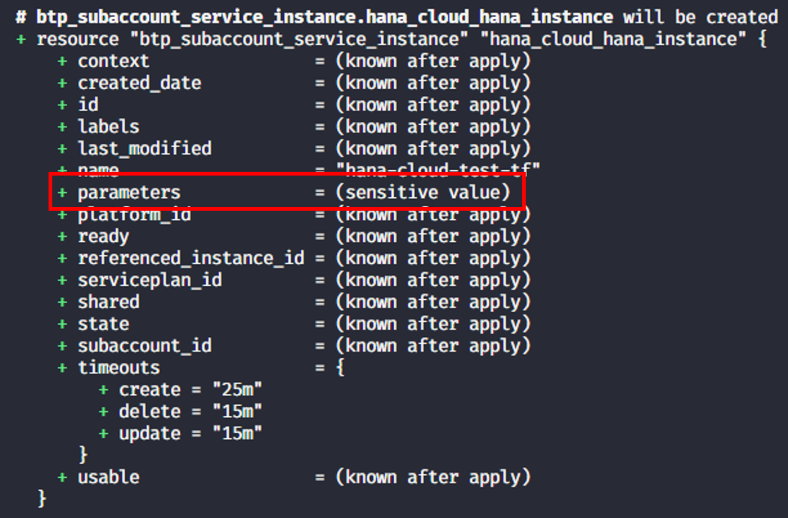
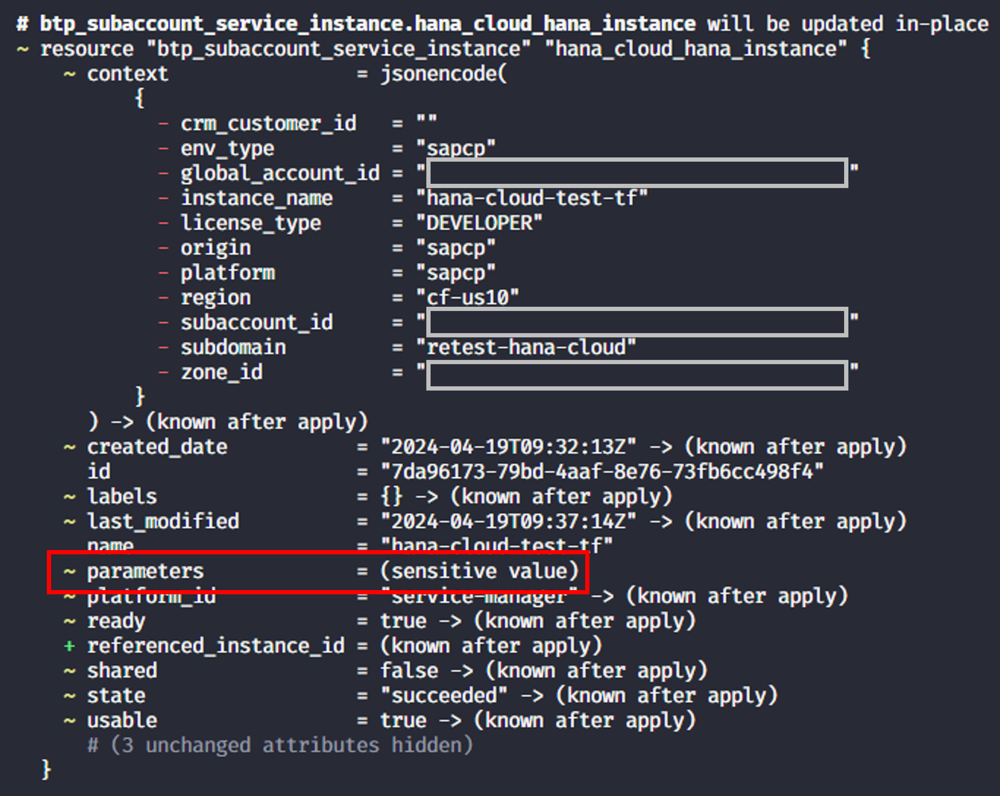
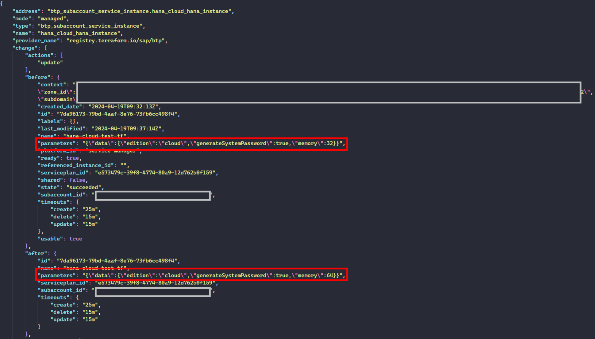

# Accessing sensitive data in local executions

## Introduction

Terraform ensures that sensitive data is not exposed to any CLI output. From a provider perspective marking the right portions of the data as sensitive is important. In case of the Terraform provider we also make use of this feature to ensure that no sensitive data is exposed when e.g., the `terraform plan` command is executed in a CI/CD pipeline.

From a consumer perspective, you can identify the relevant parts of the data in the schema of the resources as the corresponding field is annotated with "sensitive". One prominent example is the field `parameters` in the resource [`btp_subaccount_service_instance`](https://registry.terraform.io/providers/SAP/btp/latest/docs/resources/subaccount_service_instance#parameters) which is marked as sensitive.

Fields marked with the `sensitive` attribute are obfuscated in Terraform commands providing a basic safeguard of leaking credentials. However, the values are always stored in the state file in plain text. This is also the reason why you should store these state files in encrypted storages.

## Scenario

Assuming that you are evaluating a Terraform setup and are running into issues with the `btp_subaccount_service_instance` resource. To find the cause of the issue it would be beneficial to see the values Terraform is using in a create or an update operation. This is not possible from the Terraform CLI (see also this [discussion](https://discuss.hashicorp.com/t/how-to-show-sensitive-values/24076/1) in the Hashicorp Terraform forum).

How to best deal with this situation as you it might be useful to see the actual or updated values or values updates Terraform is using in a create or update operation? We describe a procedure to achieve this in the following section.

## Solution

Usually the *output* of a Terraform planning is the best spot to check the data used by Terraform especially as you get direct insights what will be changed. As an example, we take a service instance of HANA Cloud. As the `parameters` field is sensitive you do not see its content during the planning when creating the service instance:



or when updating the service instance:



To get access to the parameters in clear text and being able to check the values used by Terraform we must make a small detour via storing the output of the `terraform plan` command in a JSON file. The following commands show how to do this:

```bash
terraform plan -out=tfplan
terraform show -json tfplan > tfplan.json
```

The first command creates a plan file `tfplan` which is in a Terraform specific format. The second command takes this information and then translates the content into a JSON file `tfplan.json`. 

> **Note** - The output files of the planning must not be stored in a source code repository or any other public place as they contain sensitive data. Make sure that they are included in the `.gitignore` file.

This JSON contains the full information of the plan including the sensitive data in plain text in a format that allows you to distinguish the values of the current state and the values that will be applied.:



Following this approach gives you access to the sensitive data for your analysis. You can e.g., use [jq](https://jqlang.github.io/jq/) to extract the data on the command line.
