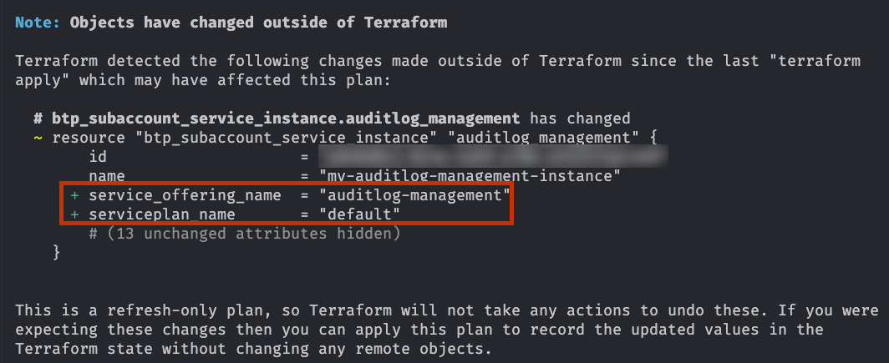
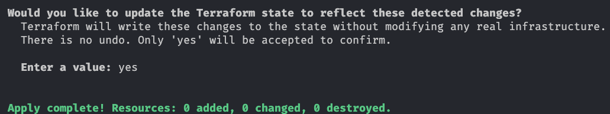

# Switch to Service Instance Configuration by Service offering and Service Plan Name

> [!IMPORTANT]
> This guide is relevant from release 1.22.0 of the Terraform provider for SAP BTP.

## Overview

Until release 1.22.0 of the Terraform provider for SAP BTP, the resource `btp_subaccount_service_instance` required the technical ID of the service plan (attribute `serviceplan_id`) to be specified in the resource configuration. This technical ID is not easily accessible for users and requires additional effort to retrieve it i.e., by calling the data source `btp_subaccount_service_plan`. To improve the user experience, the resource `btp_subaccount_service_instance` has been enhanced to allow users to specify the service instance configuration by using the service offering name and the service plan name instead of the technical ID. The provider will then automatically resolve the technical ID based on the provided names.

This guide should help you to switch your existing configuration of `btp_subaccount_service_instance` to the new configuration by using the service offering name and the service plan name.

## Prerequisite

Make sure that you have a backup of your Terraform state and your Terraform configuration before you start with the switch. This will allow you to easily revert back to the previous configuration in case of any issues.

## Procedure

For this sample we assume that you have an existing configuration of `btp_subaccount_service_instance` using a Terraform provider for SAP BTP release prior to 1.22.0 and you want to switch to the new configuration by using the service offering name and the service plan name.

Here is an example of such a setup:

```terraform
terraform {
  required_providers {
    btp = {
      source  = "SAP/btp"
      version = "1.21.3"
    }
  }
}

provider "btp" {
  globalaccount = "my-globalaccount-subdomain"
  idp           = "my-custom-idp"
}

resource "btp_subaccount" "this" {
  name      = "Sample Subaccount"
  subdomain = "sample-subaccount"
  region    = "us10"
}

data "btp_subaccount_service_plan" "by_name" {
  subaccount_id = btp_subaccount.this.id
  name          = "default"
  offering_name = "auditlog-management"
}

resource "btp_subaccount_service_instance" "auditlog_management" {
  subaccount_id  = btp_subaccount.this.id
  serviceplan_id = data.btp_subaccount_service_plan.by_name.id
  name           = "my-auditlog-management-instance"
}
```

To switch to the new configuration, execute the following steps:

1. Update the provider version to 1.22.0 or later in your Terraform configuration.
2. Execute the command `terraform init -upgrade` to update the provider.
3. Execute the command `terraform plan --refresh-only` to plan a refresh of the state. This will populate the new attributes `service_offering_name` and `serviceplan_name` in the state based on the existing configuration. You will see a output like this for the resource `btp_subaccount_service_instance`:

   

4. Execute the command `terraform apply --refresh-only` to apply the refresh. This will update the state with the new attributes `service_offering_name` and `serviceplan_name`. You will see a output like this for the resource `btp_subaccount_service_instance`:

   

5. Update the resource configuration of `btp_subaccount_service_instance` to use the new attributes `service_offering_name` and `serviceplan_name` instead of `serviceplan_id` and remove the data source `btp_subaccount_service_plan`. The updated configuration should look like this:

   ```terraform
   terraform {
     required_providers {
       btp = {
         source  = "SAP/btp"
         version = "1.22.0"
       }
     }
   }

   provider "btp" {
     globalaccount = "my-globalaccount-subdomain"
     idp           = "my-custom-idp"
   }

   resource "btp_subaccount" "this" {
     name      = "Sample Subaccount"
     subdomain = "sample-subaccount"
     region    = "us10"
   }

   resource "btp_subaccount_service_instance" "auditlog_management" {
     subaccount_id  = btp_subaccount.this.id
     service_offering_name = "auditlog-management"
     serviceplan_name = "default"
     name           = "my-auditlog-management-instance"
   }
   ```
5. Execute the command `terraform plan` to review the changes. You should see that Terraform does not plan any changes to be applied.
